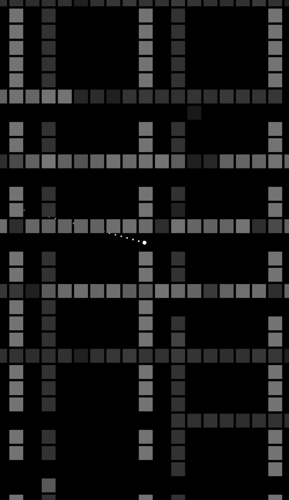

# iMemgame

<https://github.com/aidatorajiro/MemgameJS> for iPhone.

## How to run (non-jailbroken version)

1. Install Xcode on your PC.
2. Clone or download this project.
3. Open ios/memgame.xcworkspace (white one, not blue one).
4. Click blue icon named "memgame" at left menubar.
5. Click "memgame" under "TARGETS".
6. Go to "Signing & Capabilities" and set "Team".
7. Run with Command + R.

## How to run (jailbroken version)

1. Install Xcode on your PC.
2. Copy /Applications/Xcode.app/Contents/Developer/Platforms/iPhoneOS.platform/Developer/SDKs/iPhoneOS.sdk/SDKSettings.plist to Desktop
3. Open copied SDKSettings.plist
4. Set DefaultProperties > ENTITLEMENTS_REQUIRED to NO.
5. Set DefaultProperties > CODE_SIGNING_REQUIRED to NO.
6. Save SDKSettings.plist
7. Overwrite /Applications/Xcode.app/Contents/Developer/Platforms/iPhoneOS.platform/Developer/SDKs/iPhoneOS.sdk/SDKSettings.plist with edited SDKSettings.plist (you will need computer password)
8. Clone or download this project.
9. Open ios/memgame.xcworkspace (white one, not blue one).
10. Build with Command + B.
11. Jailbreak your iPhone and install OpenSSH. Please set the root password for security.
12. Run this command in Terminal: `scp -r /Users/[ your computer username here ]/Library/Developer/Xcode/DerivedData/memgame-*/Build/Products/Debug-iphoneos/memgame.app root@[ your phone IP address here ]:/Applications/memgame.app`
13. Enter phone root password.
14. `scp -r [ path to clone directory ]/ent.xml root@[ your phone IP address here ]:/Applications/memgame.app`
15. Enter phone root password.
16. `ssh root@[ your phone IP address here ]`
17. Enter phone root password.
18. `cd /Applications/memgame.app`
19. `ldid -Sent.xml memgame`
20. `uicache`
21. `exit`
22. `npm install` (If you don't have node.js, install it first.)
23. `npm start`
24. Connect your PC and phone in same Wi-fi network.

Then "memgame" icon will appear in your phone. Tap it to play!
